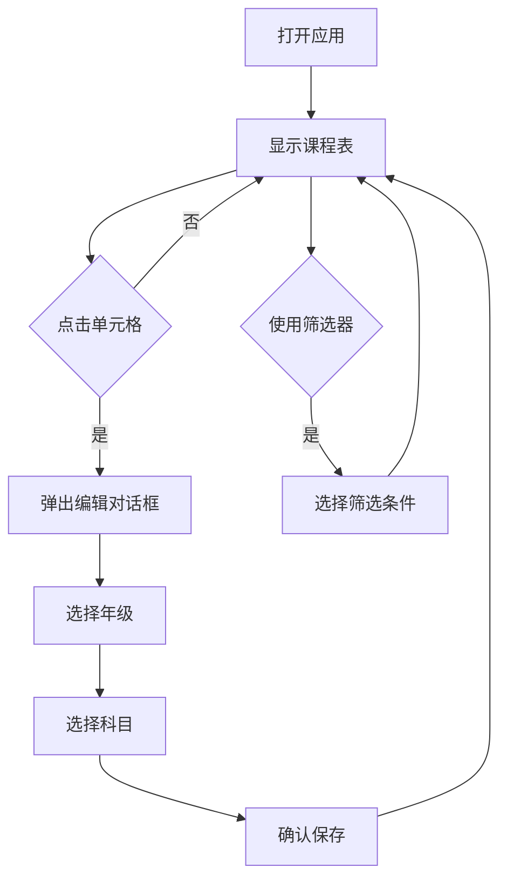

## 1. 产品概述

排课小工具是一款面向培训机构和学校教师的轻量级课程安排应用，帮助用户快速创建和管理课程表。

- 核心功能：可视化排课、灵活配置时间段、多教室管理、颜色编码识别
- 目标用户：培训机构教师、学校教务人员
- 解决问题：传统排课繁琐、难以直观展示、调整困难

## 2. 核心功能

### 2.1 功能模块

1. **课程表主界面**：展示完整排课表格，支持周五/周六/周日分区显示
2. **单元格编辑**：点击单元格弹出对话框，选择年级和科目
3. **颜色配置**：按年级设置背景色，按科目设置字体颜色
4. **筛选器**：按日期、年级、科目筛选显示内容
5. **标题编辑**：支持编辑课程表标题（如学期名称）
6. **时间段管理**：支持自定义多个时间段
7. **教室管理**：默认3个教室，支持扩展

### 2.2 页面详情

| 页面名称 | 模块名称 | 功能描述 |
|----------|----------|----------|
| 课程表主界面 | 标题栏 | 显示和编辑课程表标题、日期 |
| 课程表主界面 | 筛选器 | 日期筛选、年级筛选、科目筛选、全选/取消 |
| 课程表主界面 | 表格区域 | 时间列、教室列、可编辑单元格 |
| 课程表主界面 | 工具栏 | 添加时间段、管理教室、颜色设置 |
| 单元格编辑 | 编辑对话框 | 选择年级、选择科目、清除课程 |

## 3. 核心流程

用户打开应用 → 查看默认课程表（周五/周六/周日）→ 点击单元格 → 弹出编辑对话框 → 选择年级和科目 → 确认保存 → 单元格显示对应内容（带颜色）→ 可随时筛选查看特定日期、年级或科目



## 4. 用户界面设计

### 4.1 设计风格

- **主色调**：米白色背景 (#FAF7F2) + 深棕色文字 (#3D3D3D)
- **强调色**：暖色调（橙黄、红色系），符合培训机构风格
- **单元格样式**：圆角设计，悬停效果，选中高亮
- **字体**：标题使用衬线字体，正文使用无衬线字体
- **布局**：固定表头，表格可滚动

### 4.2 颜色预设（年级背景色）

| 年级 | 预设背景色 |
|------|-----------|
| 初一 | #E8F5E9 (浅绿) |
| 初二 | #E3F2FD (浅蓝) |
| 初三 | #FFF3E0 (浅橙) |
| 高一 | #F3E5F5 (浅紫) |
| 高二 | #FFF9C4 (浅黄) |
| 高三 | #FFEBEE (浅红) |

### 4.3 颜色预设（科目字体色）

| 科目 | 预设字体色 |
|------|-----------|
| 数学 | #1565C0 (蓝色) |
| 物理 | #2E7D32 (绿色) |
| 化学 | #C62828 (红色) |

### 4.4 页面设计概览

| 页面名称 | 模块名称 | UI元素 |
|----------|----------|--------|
| 课程表主界面 | 标题栏 | 居中大号标题、日期显示、编辑按钮 |
| 课程表主界面 | 筛选器区 | 日期标签按钮组、年级标签按钮组、科目标签按钮组、全选按钮 |
| 课程表主界面 | 表格区 | 双线边框、单元格悬停高亮、选中状态 |
| 课程表主界面 | 工具栏 | 时间段管理按钮、教室设置按钮 |
| 编辑对话框 | 模态框 | 下拉选择框、确认/取消按钮、清除按钮 |

### 4.5 响应式设计

- 桌面优先设计，1280px 以上最佳体验
- 平板适配：768px-1024px，表格横向滚动
- 移动端：暂不优先支持

## 5. 数据结构

### 5.1 年级数据

```
年级列表：初一、初二、初三、高一、高二、高三
```

### 5.2 科目数据

```
科目列表：数学、物理、化学
```

### 5.3 时间段数据

```
时间段：开始时间 - 结束时间（可自定义多个）
```

### 5.4 教室数据

```
教室：教室1、教室2、教室3（默认3个，可扩展）
```

### 5.5 星期数据

```
星期列表：周五、周六、周日
```

### 5.6 课程数据

```
课程 = {
  id: 唯一标识,
  dayType: 周五/周六/周日,
  timeSlotId: 时间段ID,
  classroomId: 教室ID,
  grade: 年级,
  subject: 科目
}
```
