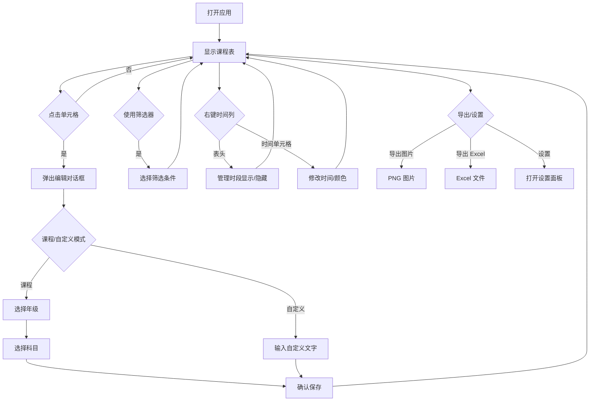

## 1. 产品概述

排课小工具是一款面向全国各学段（小学、初中、高中）培训机构和学校教师的轻量级课程安排应用，帮助用户快速创建、管理和导出课程表。

- 核心功能：可视化排课、灵活配置时间段、多教室管理、颜色编码识别、图片/Excel 导出
- 目标用户：培训机构教师、学校教务人员（覆盖小学到高中全学段）
- 解决问题：传统排课繁琐、难以直观展示、调整困难、不便分享
- 部署方式：纯前端应用，数据存储在浏览器 localStorage，已发布至 GitHub Pages

## 2. 核心功能

### 2.1 功能模块

1. **课程表主界面**：展示排课表格，按日期分区显示，支持横排/竖排布局
2. **单元格编辑**：点击单元格弹出对话框，选择年级+科目（课程模式）或输入自定义文字（自定义模式）
3. **颜色配置**：按年级设置背景色、按科目设置字体色、按日期设置标题色、支持单元格级别自定义颜色
4. **筛选器**：按日期、年级、科目筛选显示内容，支持全选/取消
5. **标题编辑**：支持编辑主标题和小标题
6. **时间段管理**：支持自定义多个时间段、拖拽排序、设置课间休息、隐藏时段
7. **教室管理**：默认3个教室，支持增删改
8. **科目管理**：默认数学/物理/化学，支持增删和颜色配置
9. **通用设置**：显示/隐藏周一至周四排课、显示/隐藏小学年级
10. **表格样式**：单元格宽高、边框、间距、多种字体大小可调
11. **数据导出**：导出图片（PNG）、导出 Excel、导出/导入设置（JSON）
12. **右键菜单**：右键时间表头管理时段显示/隐藏，右键时间单元格修改时间和颜色

### 2.2 页面详情

| 页面名称 | 模块名称 | 功能描述 |
|----------|----------|----------|
| 课程表主界面 | 标题栏 | 显示和编辑主标题、小标题 |
| 课程表主界面 | 筛选器 | 日期筛选、年级筛选、科目筛选、全选/取消、重置 |
| 课程表主界面 | 工具栏 | 隐藏提示、自定义课程、深灰筛选、横竖排切换、设置入口 |
| 课程表主界面 | 导出栏 | 导出图片、导出 Excel、导出设置、导入设置 |
| 课程表主界面 | 表格区域 | 时间列、教室列、可编辑单元格、右键菜单 |
| 单元格编辑 | 编辑对话框 | 课程/自定义模式切换、选择年级（分组分隔线）、选择科目、清除课程 |
| 设置面板 | 通用设置 | 显示周一到周四排课开关、显示小学年级开关、显示备注说明开关 |
| 设置面板 | 表格样式 | 单元格宽高、边框粗细/颜色、表格/单元格间距、时间/内容/休息/主标题/小标题/日期标题/表头字体大小 |
| 设置面板 | 时间段管理 | 增删改、拖拽排序、课间休息、隐藏时段 |
| 设置面板 | 教室管理 | 增删改教室 |
| 设置面板 | 科目管理 | 增删科目、颜色配置 |
| 设置面板 | 颜色设置 | 日期名称、日期标题颜色、年级背景色 |
| 设置面板 | 后台备注 | 仅内部查看，不导出 |
| 时段显示对话框 | 右键菜单 | 管理某天的时段显示/隐藏 |
| 时间编辑对话框 | 右键菜单 | 修改某天某时段的时间和颜色 |

## 3. 核心流程

用户打开应用 → 查看默认课程表（周五/周六/周日）→ 点击单元格 → 弹出编辑对话框 → 选择年级和科目（或输入自定义文字）→ 确认保存 → 单元格显示对应内容（带颜色）→ 可随时筛选、导出或调整设置



## 4. 用户界面设计

### 4.1 设计风格

- **主色调**：米白色背景 + 深色文字
- **强调色**：暖色调（橙黄、红色系），符合培训机构风格
- **单元格样式**：支持边框模式和卡片模式（通过单元格间距切换）
- **布局**：固定表头，表格可横向滚动，支持横排/竖排切换

### 4.2 颜色预设（年级背景色）

| 年级 | 预设背景色 |
|------|-----------|
| 一年级 | #E0F7FA (浅青) |
| 二年级 | #F1F8E9 (浅青柠) |
| 三年级 | #FFFDE7 (浅琥珀) |
| 四年级 | #FCE4EC (浅粉) |
| 五年级 | #EDE7F6 (浅紫) |
| 六年级 | #E8EAF6 (浅靛蓝) |
| 初一 | #E8F5E9 (浅绿) |
| 初二 | #E3F2FD (浅蓝) |
| 初三 | #FFF3E0 (浅橙) |
| 高一 | #F3E5F5 (浅紫) |
| 高二 | #FFF9C4 (浅黄) |
| 高三 | #FFEBEE (浅红) |

### 4.3 颜色预设（科目字体色）

| 科目 | 预设字体色 |
|------|-----------|
| 数学 | #1565C0 (蓝色) |
| 物理 | #2E7D32 (绿色) |
| 化学 | #C62828 (红色) |

### 4.4 颜色预设（日期标题色）

| 日期 | 预设标题色 |
|------|-----------|
| 周一 | #6366f1 (靛蓝) |
| 周二 | #8b5cf6 (紫色) |
| 周三 | #3b82f6 (蓝色) |
| 周四 | #06b6d4 (青色) |
| 周五 | #f97316 (橙色) |
| 周六 | #eab308 (黄色) |
| 周日 | #ef4444 (红色) |

### 4.5 页面设计概览

| 页面名称 | 模块名称 | UI元素 |
|----------|----------|--------|
| 课程表主界面 | 标题栏 | 居中主标题、小标题、编辑按钮 |
| 课程表主界面 | 筛选器区 | 日期/年级/科目标签按钮组、全选按钮、重置按钮 |
| 课程表主界面 | 工具栏 | 隐藏提示、自定义课程、深灰筛选、横竖排切换、设置按钮 |
| 课程表主界面 | 导出栏 | 图片/Excel/导出/导入按钮 |
| 课程表主界面 | 表格区 | 边框/卡片模式、单元格悬停高亮、右键菜单 |
| 编辑对话框 | 模态框 | 课程/自定义切换、年级按钮组（分组分隔线）、科目按钮组、确认/取消/清除 |
| 设置面板 | 侧边抽屉 | 通用设置、表格样式、时间段、教室、科目、颜色、后台备注 |

### 4.6 响应式设计

- 桌面优先设计，1280px 以上最佳体验
- 平板适配：768px-1024px，表格横向滚动
- 移动端：部分按钮文字隐藏，仅显示图标

## 5. 数据结构

### 5.1 年级数据

```
年级列表（12个）：
  小学：一年级、二年级、三年级、四年级、五年级、六年级
  初中：初一、初二、初三
  高中：高一、高二、高三

分组常量：
  ELEMENTARY_GRADES：一年级 ~ 六年级
  JUNIOR_GRADES：初一 ~ 初三
  SENIOR_GRADES：高一 ~ 高三
  SECONDARY_GRADES：初一 ~ 高三（初中+高中）

默认显示：仅初中+高中（6个），可在设置中开启小学年级显示
```

### 5.2 科目数据

```
科目列表：数学、物理、化学（默认，可自定义增删）
```

### 5.3 时间段数据

```
时间段 = {
  id: 唯一标识,
  startTime: 开始时间,
  endTime: 结束时间,
  isBreak: 是否为课间休息,
  breakLabel: 休息标签文字,
  breakHeight: 休息行高度,
  hidden: 是否全局隐藏
}

默认时间段：
  1. 08:00 - 09:50
  2. 10:10 - 12:00
  3. 13:30 - 15:20
  4. 15:40 - 17:30
  5. 18:40 - 20:30
```

### 5.4 教室数据

```
教室 = { id, name }
默认：教室1、教室2、教室3（可扩展）
```

### 5.5 星期数据

```
星期列表（7个）：周一、周二、周三、周四、周五、周六、周日

分组常量：
  WEEKDAY_DAYS：周一 ~ 周四
  WEEKEND_DAYS：周五 ~ 周日

默认显示：仅周五/周六/周日，可在设置中开启周一至周四排课显示
```

### 5.6 课程数据

```
课程 = {
  id: 唯一标识,
  dayType: 周一~周日,
  timeSlotId: 时间段ID,
  classroomId: 教室ID,
  entryType: 'course' | 'custom',
  grade: 年级（课程模式）,
  subject: 科目（课程模式）,
  customText: 自定义文字（自定义模式）,
  customBgColor: 自定义背景色,
  customTextColor: 自定义字体色
}
```

### 5.7 表格样式设置

```
TableSettings = {
  cellWidth: 单元格宽度,
  cellHeight: 单元格高度,
  borderWidth: 边框粗细,
  borderColor: 边框颜色,
  tableGap: 表格间距,
  cellGap: 单元格间距（>0 时切换为卡片模式）,
  timeFontSize: 时间字体大小,
  contentFontSize: 内容字体大小,
  breakFontSize: 休息字体大小,
  titleFontSize: 主标题字体大小,
  subtitleFontSize: 小标题字体大小,
  dayHeaderFontSize: 日期标题字体大小,
  headerFontSize: 表头字体大小
}
```

### 5.8 按天自定义数据

```
hiddenSlotsByDay: 每天单独隐藏的时段ID列表
customSlotTimes: 每天每时段的自定义时间 { day: { slotId: { startTime, endTime } } }
customSlotColors: 每天每时段的自定义颜色 { day: { slotId: { bgColor, textColor } } }
```

### 5.9 通用设置

```
showWeekdays: 是否显示周一至周四排课（默认 false）
showElementary: 是否显示小学年级（默认 false）
showNotes: 是否显示备注说明（默认 true，关闭后截图不包含备注）
hidePlaceholders: 是否隐藏"点击添加"提示
showCustomCourses: 是否显示自定义课程
dimFilteredCourses: 是否将筛选外课程深灰显示
verticalLayout: 是否竖排排列
```
