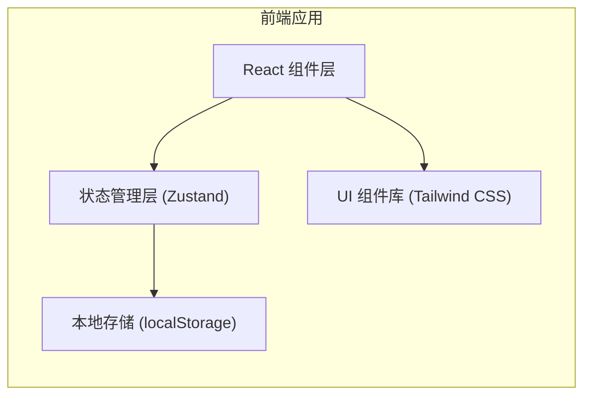

## 1. 架构设计



## 2. 技术选型

- **前端框架**：React 18 + TypeScript
- **构建工具**：Vite
- **样式方案**：Tailwind CSS 3
- **状态管理**：Zustand
- **图标库**：Lucide React
- **数据存储**：浏览器 localStorage（纯前端，无需后端）

## 3. 项目结构

```
paike2/
├── src/
│   ├── components/
│   │   ├── ScheduleTable.tsx       # 课程表主组件
│   │   ├── TableHeader.tsx         # 表头组件
│   │   ├── TableBody.tsx           # 表体组件
│   │   ├── CourseCell.tsx          # 单元格组件
│   │   ├── EditDialog.tsx          # 编辑对话框
│   │   ├── FilterBar.tsx           # 筛选器
│   │   ├── Toolbar.tsx             # 工具栏
│   │   └── ColorSettings.tsx       # 颜色设置
│   ├── store/
│   │   └── scheduleStore.ts        # Zustand 状态管理
│   ├── types/
│   │   └── index.ts                # 类型定义
│   ├── utils/
│   │   └── colors.ts               # 颜色工具函数
│   ├── data/
│   │   └── defaultData.ts          # 默认数据
│   ├── App.tsx
│   ├── main.tsx
│   └── index.css
├── index.html
├── package.json
├── vite.config.ts
├── tailwind.config.js
├── tsconfig.json
└── postcss.config.js
```

## 4. 核心类型定义

```typescript
type Grade = '初一' | '初二' | '初三' | '高一' | '高二' | '高三';
type Subject = '数学' | '物理' | '化学';
type DayType = '周五' | '周六' | '周日';

interface TimeSlot {
  id: string;
  startTime: string;
  endTime: string;
}

interface Classroom {
  id: string;
  name: string;
}

interface Course {
  id: string;
  dayType: DayType;
  timeSlotId: string;
  classroomId: string;
  grade: Grade | null;
  subject: Subject | null;
}

interface ColorConfig {
  gradeColors: Record<Grade, string>;
  subjectColors: Record<Subject, string>;
}
```

## 5. 状态管理设计

### 5.1 Zustand Store

```typescript
interface ScheduleStore {
  title: string;
  date: string;
  timeSlots: TimeSlot[];
  classrooms: Classroom[];
  courses: Course[];
  colorConfig: ColorConfig;
  filters: {
    days: DayType[];
    grades: Grade[];
    subjects: Subject[];
  };
  
  // 操作方法
  setTitle: (title: string) => void;
  addTimeSlot: (slot: TimeSlot) => void;
  removeTimeSlot: (id: string) => void;
  addClassroom: (classroom: Classroom) => void;
  removeClassroom: (id: string) => void;
  updateCourse: (course: Course) => void;
  clearCourse: (dayType: DayType, timeSlotId: string, classroomId: string) => void;
  setGradeColor: (grade: Grade, color: string) => void;
  setSubjectColor: (subject: Subject, color: string) => void;
  toggleDayFilter: (day: DayType) => void;
  toggleGradeFilter: (grade: Grade) => void;
  toggleSubjectFilter: (subject: Subject) => void;
  selectAllDays: () => void;
  selectAllGrades: () => void;
  selectAllSubjects: () => void;
}
```

### 5.2 数据持久化

使用 Zustand 的 persist 中间件，将所有状态自动保存到 localStorage。

## 6. 组件设计

### 6.1 ScheduleTable 组件
- 负责整体布局（周五/周六/周日三个分区）
- 当空间不足时支持横向滚动
- 管理表格数据加载

### 6.2 CourseCell 组件
- 显示课程内容（年级+科目）
- 处理点击事件，打开编辑对话框
- 根据年级背景色和科目字体色渲染样式

### 6.3 EditDialog 组件
- 模态对话框
- 包含年级和科目下拉选择
- 确认保存、取消、清除功能

### 6.4 FilterBar 组件
- 日期筛选标签组（周五/周六/周日）
- 年级筛选标签组
- 科目筛选标签组
- 全选/取消全选按钮

### 6.5 Toolbar 组件
- 添加时间段按钮
- 管理教室按钮
- 颜色设置入口

## 7. 颜色配置方案

### 7.1 年级背景色预设

| 年级 | 颜色值 | 说明 |
|------|--------|------|
| 初一 | #E8F5E9 | 浅绿 |
| 初二 | #E3F2FD | 浅蓝 |
| 初三 | #FFF3E0 | 浅橙 |
| 高一 | #F3E5F5 | 浅紫 |
| 高二 | #FFF9C4 | 浅黄 |
| 高三 | #FFEBEE | 浅红 |

### 7.2 科目字体色预设

| 科目 | 颜色值 | 说明 |
|------|--------|------|
| 数学 | #1565C0 | 深蓝 |
| 物理 | #2E7D32 | 深绿 |
| 化学 | #C62828 | 深红 |

用户可通过颜色设置界面自定义修改这些颜色。

## 8. 运行方式

```bash
# 安装依赖
npm install

# 开发模式
npm run dev

# 构建生产版本
npm run build

# 预览生产版本
npm run preview
```
